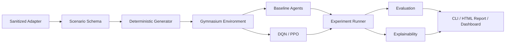

<div align="center">
  
  <h1>RLAttack</h1>
  <p><strong>See every decision. Trust every run.</strong></p>
  <p>
    실제 시스템을 건드리지 않고, 결정론적 공격 그래프 안에서<br>
    강화학습 정책을 만들고 비교하고 설명하는 simulation observatory.
  </p>
  <p>
    <a href="https://github.com/MintKangaroo/RLattack/actions/workflows/ci.yml"></a>
    
    
    
    <a href="LICENSE"></a>
  </p>
  <p>
    <a href="#빠른-시작">빠른 시작</a> ·
    <a href="#simulation-observatory">대시보드</a> ·
    <a href="docs/methodology.md">실험 방법론</a> ·
    <a href="docs/api.md">API</a> ·
    <a href="SECURITY.md">안전 정책</a>
  </p>
</div>

---

<picture>
  <source media="(max-width: 700px)" srcset="docs/assets/dashboard-mobile.png">
  
</picture>

> 위 화면의 topology, reward, risk, benchmark, decision trace는 장식용 샘플이 아닙니다.
> `AttackPathEnv`를 seed `42`로 실제 실행해 생성한 결과입니다.

## 왜 RLAttack인가?

보안 경로 탐색 연구는 재현하기 어렵고, 실제 인프라와 결합하면 안전성과 비교 가능성을 동시에
잃기 쉽습니다. RLAttack은 문제를 검증된 합성 graph와 Gymnasium MDP로 제한해 같은 scenario와
seed가 언제나 같은 trajectory를 만들도록 합니다.

| 재현 가능한 실험 | 설명 가능한 판단 | 안전한 연구 경계 |
| --- | --- | --- |
| Scenario·seed·reward·budget을 명시적으로 기록합니다. | 모든 action의 유효성, reward, risk, 영향을 받은 node를 추적합니다. | Socket, scanner, exploit, shell, 실제 credential을 사용하지 않습니다. |
| Random, Greedy, Rule-based, Graph Oracle, DQN, PPO를 같은 환경에서 비교합니다. | Graph overlay와 decision trace를 HTML·JSON으로 내보냅니다. | Dashboard도 loopback 주소에서 simulation만 실행합니다. |

## 빠른 시작

Python 3.10 이상이 필요합니다.

```bash
git clone https://github.com/MintKangaroo/RLattack.git
cd RLattack

python3 -m venv .venv
source .venv/bin/activate
python -m pip install -e ".[dev,dashboard]"
```

첫 실험과 self-contained HTML report를 생성합니다.

```bash
rlattack demo
```

```text
RLAttack deterministic experiment
  scenario : generated-medium-hard-42
  policy   : Greedy
  outcome  : success
  steps    : 38 / 64
  reward   : 20.67
  report   : .../artifacts/rlattack-report.html
```

생성된 `artifacts/rlattack-report.html`은 서버 없이 열 수 있고, 결과 데이터도 파일 안에
포함됩니다.

## Simulation Observatory

인터랙티브 대시보드를 실행한 뒤 <http://127.0.0.1:8000>을 엽니다.

```bash
rlattack dashboard
# 또는
make dashboard
```

대시보드에서 다음 조건을 바꿔 즉시 다시 실행할 수 있습니다.

- Scenario size: `small`, `medium`, `large`
- Difficulty: `easy`, `medium`, `hard`
- Policy: `random`, `greedy`, `rule-based`, `shortest-path`
- Reward: `sparse`, `shaped`, `risk-aware`, `cost-aware`
- Seed와 step budget

화면은 host topology와 oracle route, episode outcome, cumulative reward, detection risk,
graph path cost, baseline success rate, 전체 decision trace를 함께 보여줍니다. `Export JSON`으로
현재 실험을 그대로 저장할 수도 있습니다.

> Dashboard는 `127.0.0.1`, `localhost`, `::1`에만 bind할 수 있습니다. 외부 host bind는
> 코드 수준에서 거부합니다.

## CLI

### 재현 가능한 report 만들기

```bash
rlattack demo \
  --size medium \
  --difficulty hard \
  --seed 42 \
  --agent greedy \
  --reward risk-aware \
  --step-budget 64 \
  --episodes 8 \
  --report artifacts/experiment.html \
  --json artifacts/experiment.json
```

### Scenario JSON 내보내기

```bash
rlattack scenario \
  --size large \
  --difficulty medium \
  --seed 7 \
  --output artifacts/scenario.json
```

| Command | 역할 |
| --- | --- |
| `rlattack demo` | Episode와 4개 baseline benchmark를 실행하고 HTML report 생성 |
| `rlattack scenario` | 검증된 deterministic scenario를 JSON으로 내보내기 |
| `rlattack dashboard` | loopback 전용 interactive dashboard와 API 실행 |
| `rlattack --version` | 설치된 package version 확인 |

`python -m rlattack`도 같은 CLI를 실행합니다.

## Python API

### Scenario와 environment

```python
import numpy as np

from rlattack.env import AttackPathEnv
from rlattack.generator import generate_scenario

scenario = generate_scenario(size="medium", difficulty="hard", seed=42)
env = AttackPathEnv(scenario, step_budget=64)

observation, info = env.reset(seed=42)
action = np.int64(np.flatnonzero(info["action_mask"])[0])
observation, reward, terminated, truncated, info = env.step(action)
```

### 설명 가능한 episode

```python
from rlattack.experiment import run_episode
from rlattack.generator import generate_scenario

scenario = generate_scenario("small", "easy", seed=7)
result = run_episode(
    scenario,
    agent_name="shortest-path",
    seed=7,
    reward_strategy="shaped",
)

print(result.success, result.steps, result.path_cost)
print(result.trace[-1].action)
```

### Dashboard view model

```python
from rlattack.experiment import ExperimentConfig, build_dashboard_data

data = build_dashboard_data(
    ExperimentConfig(
        size="medium",
        difficulty="hard",
        seed=42,
        agent="greedy",
        reward_strategy="risk-aware",
    )
)
```

## Environment 설계

Observation은 오직 agent가 현재까지 관찰한 simulation state로 구성됩니다.

| Observation | 의미 |
| --- | --- |
| `discovered_hosts` / `reachable_hosts` | 발견·도달 상태 |
| `known_services` | 확인한 service |
| `validated_vulnerabilities` | 검증된 synthetic weakness |
| `acquired_credentials` / `acquired_privileges` | simulation 내부 상태 |
| `detection_risk` | 누적 normalized risk |
| `steps_remaining` | 남은 episode budget |

Action space는 고정된 9개 discrete action입니다.

| Action | In-process 상태 전이 |
| --- | --- |
| `discover_host` | graph edge를 따라 새 host 발견 |
| `scan_service` | 발견된 host의 다음 service 확인 |
| `enumerate_service` | service 상세 관찰 및 detection risk 반영 |
| `validate_vulnerability` | 모델링된 weakness 검증 |
| `attempt_simulated_access` | access edge를 credential state로 전이 |
| `escalate_simulated_privilege` | privilege edge 적용 |
| `pivot_simulated_network` | 다음 host로 simulation path 확장 |
| `collect_simulated_objective` | 조건을 만족한 objective 수집 |
| `stop` | episode 자발적 종료 |

각 step은 `action_mask`, `valid_action`, `affected_nodes`, `detection_risk`, 실제 graph
`path_cost`를 `info`에 기록합니다. 목표 달성·자발적 중단은 `terminated`, budget 소진은
`truncated`입니다.

## 아키텍처



| Module | 책임 |
| --- | --- |
| `rlattack.scenario` | Pydantic schema, reference integrity, NetworkX 변환 |
| `rlattack.generator` | size·difficulty·seed 기반 synthetic graph |
| `rlattack.env` | deterministic Gymnasium transition과 action mask |
| `rlattack.agents` | Random, Greedy, Rule-based, Graph Oracle |
| `rlattack.experiment` | episode trace와 dashboard view model의 단일 실행 엔진 |
| `rlattack.evaluation` | 동일 seed 기반 benchmark metric |
| `rlattack.explain` | action explanation과 visited-node overlay |
| `rlattack.training` | optional Stable-Baselines3 DQN/PPO pipeline |
| `rlattack.adapter` | live identifier를 거부하는 sanitized file adapter |
| `rlattack.report` / `dashboard` | portable HTML report와 loopback API |

자세한 경계와 데이터 흐름은 [Architecture](docs/architecture.md)를 참고하세요.

## Benchmark와 reward

내장 baseline은 동일한 scenario·seed·step budget에서 평가됩니다.

- `Random`: 유효 action을 균등 표본화하는 하한선
- `Greedy`: 목표·권한·접근·검증을 우선하는 진행 중심 policy
- `Rule-based`: 명시적인 reconnaissance-to-objective 순서
- `Graph Oracle`: static host graph의 최단 route를 참고하는 상한선

Reward strategy는 실험 목적에 따라 교체할 수 있습니다.

| Strategy | 초점 |
| --- | --- |
| `sparse` | objective 달성 중심 |
| `shaped` | 발견·검증·접근·권한 상승에 중간 보상 |
| `risk-aware` | detection risk를 더 크게 감점 |
| `cost-aware` | step과 중복 action 비용을 더 크게 감점 |

공통 metric은 success rate, mean steps, cumulative reward, terminal detection risk,
weighted graph path cost입니다. 전체 프로토콜과 한계는
[Experimental Methodology](docs/methodology.md)에 정리되어 있습니다.

## DQN / PPO 학습

PyTorch와 Stable-Baselines3는 선택 dependency입니다.

```bash
python -m pip install -e ".[training]"
```

`train_dqn`과 `train_ppo`는 vectorized environment, checkpoint, evaluation callback,
TensorBoard log 계약을 공유합니다. 장기 학습은 CI에서 실행하지 않습니다.

## 품질 게이트

```bash
make check
```

- Ruff lint + format
- strict mypy
- 65 deterministic tests
- package statement coverage 100%
- Gymnasium environment checker
- FastAPI dashboard route와 loopback bind test

CI는 Python 3.12에서 동일한 gate를 실행합니다.

## 안전 범위

RLAttack의 security 용어는 연구 domain을 표현할 뿐이며 모두 메모리 안의 상태 전이입니다.

**포함하지 않는 기능**

- Nmap 또는 network scanner
- exploit framework, payload, malware
- 실제 credential 인증·수집
- local/remote shell과 임의 subprocess
- persistence, evasion, destructive action, exfiltration
- public network 또는 live target 연결

외부 자료는 [sanitized adapter](src/rlattack/adapter.py)를 통해서만 가져오며 IP, URL,
domain, password, token, exploit/payload 필드를 거부합니다. 자세한 내용은
[Security Policy](SECURITY.md)와 [Threat Model](docs/threat-model.md)을 확인하세요.

## 프로젝트 상태

- [x] Validated graph scenario schema
- [x] Deterministic Gymnasium environment
- [x] Small / medium / large scenario generator
- [x] Four baseline policies
- [x] DQN / PPO training pipeline
- [x] Four reward strategies
- [x] Reproducible evaluation and explainability
- [x] Sanitized ThreatGraph adapter
- [x] CLI, portable HTML report, interactive dashboard
- [x] Desktop and mobile dashboard verification

현재 `v0.2.0`은 연구용 end-to-end workflow를 제공합니다. 실제 환경의 다양성을 합성 graph가
완전히 대표하지 않으며, explainability output은 인과적 설명이나 보안 보장을 의미하지 않습니다.

## 문서

- [Architecture](docs/architecture.md)
- [Dashboard/API](docs/api.md)
- [Experimental Methodology](docs/methodology.md)
- [Threat Model](docs/threat-model.md)
- [Roadmap](docs/roadmap.md)
- [Contributing](CONTRIBUTING.md)
- [Security Policy](SECURITY.md)

## License

[MIT](LICENSE) © AI Security Lab Contributors
