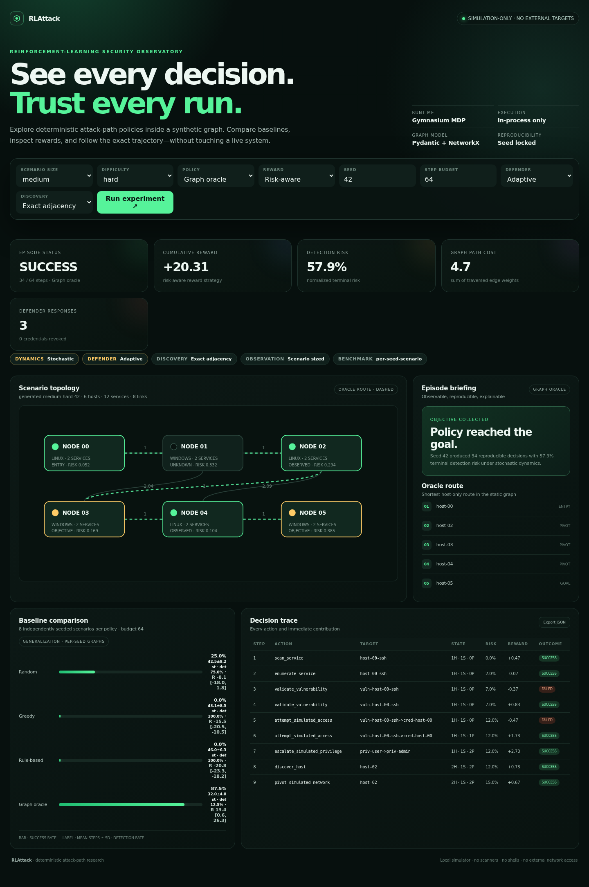
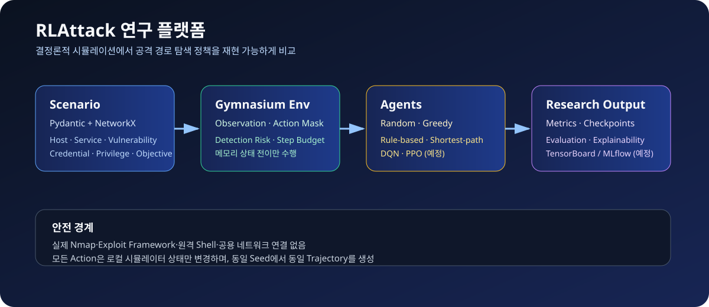
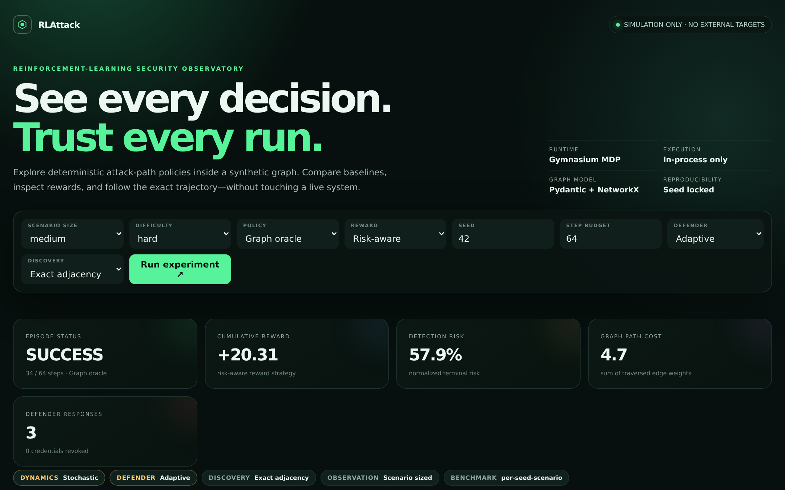
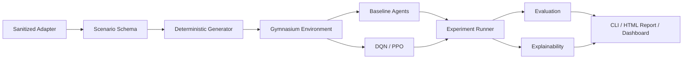

<div align="center">
  
  <h1>RLAttack</h1>
  <p><strong>See every decision. Trust every run.</strong></p>
  <p>
    실제 시스템을 건드리지 않고, 결정론적 공격 그래프 안에서<br>
    강화학습 정책을 만들고 비교하고 설명하는 simulation observatory.
  </p>
  <p>
    <a href="https://github.com/MintKangaroo/RLattack/actions/workflows/ci.yml"></a>
    
    
    
    <a href="LICENSE"></a>
  </p>
  <p>
    <a href="#빠른-시작">빠른 시작</a> ·
    <a href="#simulation-observatory">대시보드</a> ·
    <a href="docs/methodology.md">실험 방법론</a> ·
    <a href="docs/api.md">API</a> ·
    <a href="SECURITY.md">안전 정책</a>
  </p>
</div>

---



> 위 화면의 topology, reward, risk, benchmark, decision trace는 장식용 샘플이 아닙니다.
> `rlattack demo --agent shortest-path --defender adaptive --seed 42` 실행 화면입니다.
> `AttackPathEnv`를 seed `42`로 실제 실행해 생성한 결과입니다.

## 왜 RLAttack인가?

보안 경로 탐색 연구는 재현하기 어렵고, 실제 인프라와 결합하면 안전성과 비교 가능성을 동시에
잃기 쉽습니다. RLAttack은 문제를 검증된 합성 graph와 Gymnasium MDP로 제한해 같은 scenario와
seed가 언제나 같은 trajectory를 만들도록 합니다.

| 재현 가능한 실험 | 설명 가능한 판단 | 안전한 연구 경계 |
| --- | --- | --- |
| Scenario·seed·reward·budget을 명시적으로 기록합니다. | 모든 action의 유효성, reward, risk, 영향을 받은 node를 추적합니다. | Socket, scanner, exploit, shell, 실제 credential을 사용하지 않습니다. |
| Random, Greedy, Rule-based, Graph Oracle, DQN, PPO를 같은 환경에서 비교합니다. | Graph overlay와 decision trace를 HTML·JSON으로 내보냅니다. | Dashboard도 loopback 주소에서 simulation만 실행합니다. |

## 한눈에 보는 실행 흐름



Scenario Generator가 검증된 graph를 만들고, Gymnasium Environment가 action mask와 state
transition을 제공합니다. Baseline·DQN·PPO agent는 같은 environment를 사용하며, 결과는
evaluation·explainability 계층을 거쳐 CLI, HTML report, dashboard에 동일하게 표시됩니다.

## 빠른 시작

Python 3.10 이상이 필요합니다.

```bash
git clone https://github.com/MintKangaroo/RLattack.git
cd RLattack

python3 -m venv .venv
source .venv/bin/activate
python -m pip install -e ".[dev,dashboard]"
```

첫 실험과 self-contained HTML report를 생성합니다.

```bash
rlattack demo
```

```text
RLAttack deterministic experiment
  scenario : generated-medium-hard-42
  policy   : Greedy
  outcome  : success
  steps    : 38 / 64
  reward   : 20.67
  report   : .../artifacts/rlattack-report.html
```

생성된 `artifacts/rlattack-report.html`은 서버 없이 열 수 있고, 결과 데이터도 파일 안에
포함됩니다.

## Simulation Observatory

인터랙티브 대시보드를 실행한 뒤 <http://127.0.0.1:8000>을 엽니다.

```bash
rlattack dashboard
# 또는
make dashboard
```

대시보드에서 다음 조건을 바꿔 즉시 다시 실행할 수 있습니다.

- Scenario size: `small`, `medium`, `large`
- Difficulty: `easy`, `medium`, `hard`
- Policy: `random`, `greedy`, `rule-based`, `shortest-path`
- Reward: `sparse`, `shaped`, `risk-aware`, `cost-aware`
- Seed와 step budget

화면은 host topology와 oracle route, episode outcome, cumulative reward, detection risk,
graph path cost, baseline success rate, 전체 decision trace를 함께 보여줍니다. `Export JSON`으로
현재 실험을 그대로 저장할 수도 있습니다.

<details>
<summary><strong>전체 Dashboard 스크린샷 보기</strong></summary>
<br>
<picture>
  <source media="(max-width: 700px)" srcset="docs/assets/dashboard-mobile.png">
  
</picture>
</details>

> Dashboard는 `127.0.0.1`, `localhost`, `::1`에만 bind할 수 있습니다. 외부 host bind는
> 코드 수준에서 거부합니다.

## CLI

### 재현 가능한 report 만들기

```bash
rlattack demo \
  --size medium \
  --difficulty hard \
  --seed 42 \
  --agent greedy \
  --reward risk-aware \
  --step-budget 64 \
  --episodes 8 \
  --report artifacts/experiment.html \
  --json artifacts/experiment.json
```

### Scenario JSON 내보내기

```bash
rlattack scenario \
  --size large \
  --difficulty medium \
  --seed 7 \
  --output artifacts/scenario.json
```

| Command | 역할 |
| --- | --- |
| `rlattack demo` | Episode와 4개 baseline benchmark를 실행하고 HTML report 생성 |
| `rlattack benchmark` | 다중 seed generalization benchmark와 paired 유의성 검정 |
| `rlattack ablation` | reward strategy ablation과 유의성 검정 |
| `rlattack transfer` | 9개 scenario class 전체에 대한 전이 평가 |
| `rlattack conditions` | defender × discovery 조건 격자에서의 평가 |
| `rlattack game` | 에피소드 간 학습하는 defender와의 대전 |
| `rlattack sweep` | hyperparameter trial 학습과 비교 |
| `rlattack train` | optional DQN/PPO policy 학습 (`.[training]` 필요) |
| `rlattack scenario` | 검증된 scenario를 JSON으로 내보내기 |
| `rlattack dashboard` | loopback 전용 interactive dashboard와 API 실행 |
| `rlattack --version` | 설치된 package version 확인 |

모든 experiment command가 공유하는 실험 조건 flag입니다.

| Flag | 의미 |
| --- | --- |
| `--deterministic` | transition uncertainty를 끄고 모든 valid action을 성공시킵니다 |
| `--defender passive\|adaptive` | 대조군(passive)과 처치군(adaptive defender) |
| `--observation scenario\|curriculum` | scenario 크기에 맞춘 관측 vs 고정 capacity |
| `--compare-to`, `--metric`, `--alpha`, `--resamples` | paired 유의성 검정 설정 |

```bash
rlattack benchmark --size medium --difficulty hard --episodes 64 \
  --output artifacts/benchmark.jsonl

rlattack ablation --agent greedy --episodes 32 --compare-to shaped
rlattack transfer --policy artifacts/policies/final.zip --episodes 32
```

`python -m rlattack`도 같은 CLI를 실행합니다.

## Python API

### Scenario와 environment

```python
import numpy as np

from rlattack.env import AttackPathEnv
from rlattack.generator import generate_scenario

scenario = generate_scenario(size="medium", difficulty="hard", seed=42)
env = AttackPathEnv(scenario, step_budget=64)

observation, info = env.reset(seed=42)

# Action은 (action_type, target) 쌍입니다.
action = np.int64(np.flatnonzero(info["action_mask"])[0])
action_type, target = env.decode_action(action)
observation, reward, terminated, truncated, info = env.step(action)

# 특정 대상을 직접 지정할 수도 있습니다.
from rlattack.env import Action

env.step(env.encode_action(Action.SCAN_SERVICE, target=0))
```

### 설명 가능한 episode

```python
from rlattack.experiment import run_episode
from rlattack.generator import generate_scenario

scenario = generate_scenario("small", "easy", seed=7)
result = run_episode(
    scenario,
    agent_name="shortest-path",
    seed=7,
    reward_strategy="shaped",
)

print(result.success, result.steps, result.path_cost)
print(result.trace[-1].action)
```

### Dashboard view model

```python
from rlattack.experiment import ExperimentConfig, build_dashboard_data

data = build_dashboard_data(
    ExperimentConfig(
        size="medium",
        difficulty="hard",
        seed=42,
        agent="greedy",
        reward_strategy="risk-aware",
    )
)
```

## Environment 설계

Observation은 오직 agent가 현재까지 관찰한 simulation state로 구성됩니다.

| Observation | 의미 |
| --- | --- |
| `discovered_hosts` / `reachable_hosts` | 발견·도달 상태 |
| `known_services` / `enumerated_services` | 확인·열거한 service |
| `validated_vulnerabilities` | 검증된 synthetic weakness |
| `acquired_credentials` / `acquired_privileges` | simulation 내부 상태 |
| `collected_objectives` | 수집한 objective |
| `alert_level` | **양자화된** 경보 단계 one-hot (정확한 risk가 아님) |
| `budget_fraction` | 남은 episode budget 비율 |

### 부분 관측

공격자는 방어자의 정확한 의심 점수를 읽을 수 없습니다. Agent는 `alert_level`만 보고,
정확한 `detection_risk`는 보고·분석용으로 `info`에만 남습니다
(`ObservationConfig(expose_exact_risk=True)`로 되돌릴 수 있습니다).

또한 `ObservationConfig.for_curriculum()`은 모든 channel을 고정 폭으로 padding합니다.
Vector 길이가 네트워크 크기를 알려주지 않게 되고, 동시에 `small`에서 학습한 policy를
`large`에 그대로 적용할 수 있습니다. Padding은 시뮬레이션에 영향을 주지 않습니다.

`enumerated_services`도 관찰 가능한 상태로 노출됩니다.

Action space는 **action type × target**입니다. Flat encoding은
`action_type * target_count + target_index`이며, policy가 "무엇을 할지"뿐 아니라
"graph의 어느 요소에 할지"까지 선택합니다.

| Action type | Target | In-process 상태 전이 |
| --- | --- | --- |
| `discover_host` | host | 도달 가능한 host에서 이어지는 edge로 대상 host 발견 |
| `pivot_simulated_network` | host | 발견된 host를 reachable로 전환 (source host의 credential foothold 필요) |
| `scan_service` | service | reachable host의 지정 service 확인 |
| `enumerate_service` | service | service 상세 관찰 및 detection risk 반영 |
| `validate_vulnerability` | vulnerability | 모델링된 weakness 검증 (확률적) |
| `attempt_simulated_access` | access edge | access edge를 credential state로 전이 (확률적) |
| `escalate_simulated_privilege` | privilege edge | privilege edge 적용 (확률적) |
| `collect_simulated_objective` | objective | 조건을 만족한 objective 수집 |
| `stop` | — | episode 자발적 종료 |

각 step은 `action_mask`, `action_type`, `target`, `target_id`, `valid_action`, `outcome`,
`affected_nodes`, `detection_risk`, `objective_captured`, `detected`, 실제 graph `path_cost`를
`info`에 기록합니다. 목표 달성·detection·자발적 중단은 `terminated`, budget 소진은
`truncated`입니다.

### 확률적이지만 재현 가능한 전이

`DynamicsConfig`가 exploitation 성공 확률, 실패 시 risk 증가, detection threshold를
정의합니다. 모든 난수는 seed된 `np_random` stream에서 나오므로 **seed가 같으면 trajectory도
같습니다**. `detection_risk`가 threshold를 넘으면 episode는 실패로 종료됩니다.

```python
from rlattack.env import AttackPathEnv, DynamicsConfig

env = AttackPathEnv(scenario, dynamics=DynamicsConfig.deterministic())  # 회귀 검증용
env = AttackPathEnv(scenario, dynamics=DynamicsConfig(detection_threshold=0.7))
```

## 아키텍처



| Module | 책임 |
| --- | --- |
| `rlattack.scenario` | Pydantic schema, reference integrity, NetworkX 변환 |
| `rlattack.generator` | size·difficulty·seed 기반 synthetic graph |
| `rlattack.env` | targeted action space, 재현 가능한 확률적 transition, action mask |
| `rlattack.agents` | Random, Greedy, Rule-based, Graph Oracle |
| `rlattack.experiment` | episode trace와 dashboard view model의 단일 실행 엔진 |
| `rlattack.evaluation` | 분산·신뢰구간을 포함한 generalization benchmark metric |
| `rlattack.defender` | 공격자 궤적에 반응하는 simulated defender |
| `rlattack.stats` | paired permutation test와 bootstrap 신뢰구간 |
| `rlattack.curriculum` | scenario stage와 전이 평가 |
| `rlattack.policies` | 학습된 Stable-Baselines3 checkpoint의 Agent adapter |
| `rlattack.export` | episode 단위 JSONL/CSV batch export |
| `rlattack.explain` | action explanation과 visited-node overlay |
| `rlattack.training` | optional Stable-Baselines3 DQN/PPO pipeline |
| `rlattack.adapter` | live identifier를 거부하는 sanitized file adapter |
| `rlattack.report` / `dashboard` | portable HTML report와 loopback API |

자세한 경계와 데이터 흐름은 [Architecture](docs/architecture.md)를 참고하세요.

## Benchmark와 reward

내장 baseline은 동일한 seed 목록과 step budget에서 평가되며, **seed마다 scenario를 새로
생성**하므로 결과는 하나의 고정 graph 재생이 아니라 generalization 성능입니다.

- `Random`: 유효 action을 균등 표본화하는 하한선
- `Greedy`: 목표·권한·접근·검증을 우선하는 진행 중심 policy
- `Rule-based`: 명시적인 reconnaissance-to-objective 순서
- `Graph Oracle`: static host graph의 최단 route를 참고하는 상한선

Reward strategy는 실험 목적에 따라 교체할 수 있습니다.

| Strategy | 초점 |
| --- | --- |
| `sparse` | objective 달성 중심 |
| `shaped` | 발견·검증·접근·권한 상승에 중간 보상 |
| `risk-aware` | detection risk를 더 크게 감점 |
| `cost-aware` | step과 중복 action 비용을 더 크게 감점 |

공통 metric은 success rate, detection rate, mean/std steps, cumulative reward와 95%
신뢰구간, terminal detection risk, weighted graph path cost입니다. Episode 단위 원본
record는 `rlattack benchmark --output`으로 내보내 외부에서 재분석할 수 있습니다.

학습된 policy는 baseline과 같은 protocol에서 비교합니다.

```bash
rlattack train --algorithm maskable-ppo --curriculum
rlattack benchmark --episodes 64 --policy artifacts/policies/final.zip \
  --policy-algorithm maskable-ppo
rlattack transfer --policy artifacts/policies/final.zip --report artifacts/transfer.html
```

공개된 결과와 재현 명령은 [Published results](docs/results.md)에 있습니다. 요약하면,
400k step curriculum으로 학습한 MaskablePPO는 `medium/hard`에서 graph oracle과 동일한
성공률(96.9%)을 내면서 보상은 유의하게 높고(+2.71, 95% CI [+1.46, +4.59], p=0.0005)
**한 번도 탐지되지 않습니다**(0.0% vs 3.1%). 더 짧은 경로가 아니라 **더 조용한 경로**를
찾기 때문입니다.

다만 이 정책은 학습한 조건에서만 유효합니다 — adaptive defender에는 영향을 받지 않지만
noisy discovery에서는 성공률 **0%**입니다. Exact adjacency로 학습해 probe하는 법을
배우지 못했기 때문입니다.

> **Action masking이 필수입니다.** 각 상태에서 유효한 action은 전체의 1~2%뿐이라
> (예: 288개 중 4개), masking 없이 학습하면 탐색 예산이 invalid action에 소모되고
> 정책이 즉시 `stop`하도록 수렴합니다. 기본 algorithm이 `maskable-ppo`인 이유입니다.

전체 프로토콜과 한계는
[Experimental Methodology](docs/methodology.md)에 정리되어 있습니다.

## DQN / PPO 학습

PyTorch와 Stable-Baselines3는 선택 dependency입니다.

```bash
python -m pip install -e ".[training]"
```

`train_dqn`과 `train_ppo`는 vectorized environment, checkpoint, evaluation callback,
TensorBoard log 계약을 공유합니다. Train·evaluation environment는 Stable-Baselines3
`Monitor`로 동일하게 기록되며, CPU 최소 학습과 final checkpoint 생성을 실제 검증했습니다.
장기 학습은 CI에서 실행하지 않습니다.

## 품질 게이트

```bash
make check
make audit
```

- Ruff lint + format
- strict mypy
- 204 tests (unit + reproducibility/solvability integration tests)
- package statement coverage 100%
- Gymnasium environment checker
- FastAPI dashboard route와 loopback bind test
- pip-audit dependency vulnerability check

CI는 Python 3.10, 3.11, 3.12, 3.13에서 동일한 gate를 실행하고, Dependabot이 Python·GitHub
Actions dependency를 매주 확인합니다. Optional DQN/PPO CPU smoke training은 별도
`training-smoke` workflow에서 주 1회 실행합니다.

## 안전 범위

RLAttack의 security 용어는 연구 domain을 표현할 뿐이며 모두 메모리 안의 상태 전이입니다.

**포함하지 않는 기능**

- Nmap 또는 network scanner
- exploit framework, payload, malware
- 실제 credential 인증·수집
- local/remote shell과 임의 subprocess
- persistence, evasion, destructive action, exfiltration
- public network 또는 live target 연결

외부 자료는 [sanitized adapter](src/rlattack/adapter.py)를 통해서만 가져오며 IP, URL,
domain, password, token, exploit/payload 필드를 거부합니다. Export 시에는 원본 node ID를
다시 익명화하면서 Host·Service·Vulnerability 구조와 weighted edge를 보존합니다. 자세한 내용은
[Security Policy](SECURITY.md)와 [Threat Model](docs/threat-model.md)을 확인하세요.

## 프로젝트 상태

- [x] Validated graph scenario schema
- [x] Deterministic Gymnasium environment
- [x] Small / medium / large scenario generator
- [x] Four baseline policies
- [x] DQN / PPO training pipeline
- [x] Four reward strategies
- [x] Reproducible evaluation and explainability
- [x] Sanitized ThreatGraph adapter
- [x] CLI, portable HTML report, interactive dashboard
- [x] Desktop and mobile dashboard verification
- [x] Targeted action space (action type × graph target)
- [x] Per-seed generalization benchmark with dispersion and confidence intervals
- [x] Reproducible stochastic dynamics and detection-threshold termination
- [x] Trained DQN/PPO checkpoint benchmarking through the shared Agent protocol
- [x] Partial observability (quantized alert level, size-hiding capacities)
- [x] Adaptive defender (monitoring hardening, credential revocation)
- [x] Multi-objective episodes and paired significance testing
- [x] Scenario curriculum and transfer evaluation across all nine classes
- [x] Action-masked training, and published 100k/400k curriculum policies
- [x] Condition-grid robustness evaluation and a learning (bandit) defender
- [x] Hyperparameter sweep infrastructure

현재 `v0.4.0`은 연구용 end-to-end workflow를 제공합니다. 실제 환경의 다양성을 합성 graph가
완전히 대표하지 않으며, explainability output은 인과적 설명이나 보안 보장을 의미하지 않습니다.
다음 확장 후보(noisy discovery 조건에서의 학습, 두 학습자 게임, 외부 attack-graph 데이터셋)는
[Roadmap](docs/roadmap.md)에서 관리합니다. 변경 이력은 [CHANGELOG](CHANGELOG.md)를 참고하세요.

## 문서

- [Architecture](docs/architecture.md)
- [Dashboard/API](docs/api.md)
- [Experimental Methodology](docs/methodology.md)
- [Threat Model](docs/threat-model.md)
- [Published results](docs/results.md)
- [Changelog](CHANGELOG.md)
- [Roadmap](docs/roadmap.md)
- [Contributing](CONTRIBUTING.md)
- [Security Policy](SECURITY.md)

## License

[MIT](LICENSE) © AI Security Lab Contributors
