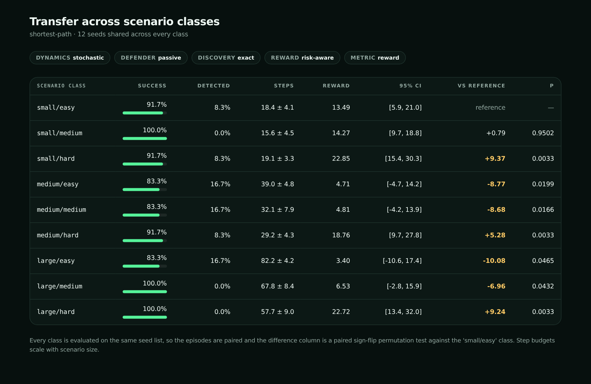

# Published results

All numbers here come from `rlattack` commands in this repository. Every run is seeded,
so they can be reproduced exactly with the commands shown.

Model checkpoints are not committed (`artifacts/` is ignored). Regenerate them with the
training command below.

## Setup

```bash
python -m pip install -e ".[dev,training]"
rlattack train --algorithm maskable-ppo --curriculum --seed 42 \
  --curriculum-timesteps 400000 --output-dir artifacts/policies/mppo-400k

# the same budget under the noisy-discovery condition
rlattack train --algorithm maskable-ppo --curriculum --seed 42 \
  --curriculum-timesteps 400000 --discovery noisy \
  --output-dir artifacts/policies/mppo-noisy
```

The curriculum is `small/easy → small/hard → medium/medium → medium/hard`, carried as
one policy with `set_env` and `reset_num_timesteps=False`. Two budgets are reported
below, 100k and 400k, because the shorter one is a floor rather than a result.

## Why action masking is not optional

Only 1-2% of the targeted action space is valid in any given state - 4 of 288 at reset
on a small scenario. An unmasked learner spends its exploration budget on invalid
actions.

100k-step **unmasked** curriculum runs, evaluated across all nine scenario classes,
24 seeds each:

| Algorithm | Success | Steps | Reward |
| --- | --- | --- | --- |
| PPO (unmasked), every class | 0.0% | 4.00 ± 0.00 | 1.88 |
| DQN (unmasked), every class | 0.0% | 4.00 ± 0.00 | 1.88 |

Both converged on three actions followed by `stop`, producing an identical episode in
every class - the zero standard deviation is the tell. That is the reason
`maskable-ppo` is the default training algorithm.

## Baseline transfer table

Graph oracle, 24 shared seeds, control condition (passive defender, exact discovery,
`risk-aware` reward). Step budgets scale with scenario size, so `steps` is comparable
within a class but not across them.

| Scenario class | Success | Detected | Steps | Reward |
| --- | --- | --- | --- | --- |
| small/easy | 100.0% | 0.0% | 17.1 ± 3.0 | 17.42 |
| small/medium | 100.0% | 0.0% | 14.7 ± 4.0 | 16.60 |
| small/hard | 100.0% | 0.0% | 18.4 ± 3.3 | 26.07 |
| medium/easy | 87.5% | 12.5% | 38.5 ± 3.4 | 11.17 |
| medium/medium | 91.7% | 8.3% | 30.2 ± 6.1 | 11.62 |
| medium/hard | 91.7% | 8.3% | 28.3 ± 4.9 | 22.56 |
| large/easy | 83.3% | 16.7% | 82.2 ± 4.7 | 9.22 |
| large/medium | 91.7% | 8.3% | 62.6 ± 7.3 | 13.53 |
| large/hard | 100.0% | 0.0% | 55.5 ± 6.8 | 29.15 |

```bash
rlattack transfer --agent shortest-path --episodes 24 --resamples 1000 \
  --output artifacts/oracle-transfer.jsonl
```

`easy` classes are not the easiest: without shortcut edges the route is longer, so the
attacker spends more actions and accumulates more detection risk.

### Why detection risk is normalized by network size

With `normalize_risk_by_size=False` the threshold is an absolute budget of noisy
actions, and the same correctly-built oracle scores:

| Condition | small | medium | large |
| --- | --- | --- | --- |
| normalized (default) | 100% | 92-100% | 88-100% |
| absolute | 100% | 92-100% | 0-50% |

Large scenarios become unreachable purely because their routes are longer, which a
transfer table would report as a generalization failure.


## Trained policy vs the baselines

`medium/hard`, 32 shared seeds, control condition, paired against the graph oracle.

| Policy | Success | Detected | Steps | Reward | 95% CI |
| --- | --- | --- | --- | --- | --- |
| Random | 50.0% | 50.0% | 50.31 ± 6.50 | -1.72 | [-6.45, 3.02] |
| Greedy | 37.5% | 62.5% | 49.66 ± 6.86 | -6.82 | [-11.52, -2.13] |
| Rule-based | 9.4% | 90.6% | 51.50 ± 6.60 | -17.66 | [-21.09, -14.24] |
| Graph oracle | 96.9% | 3.1% | 27.34 ± 4.27 | 24.11 | [20.27, 27.96] |
| MaskablePPO (100k) | 96.9% | 3.1% | 31.72 ± 3.27 | 25.15 | [20.89, 29.42] |
| **MaskablePPO (400k)** | **96.9%** | **0.0%** | 30.31 ± 4.73 | **26.82** | [23.96, 29.69] |

Paired sign-flip permutation test against the graph oracle, on episode reward:

| Policy | Mean difference | Bootstrap CI | p |
| --- | --- | --- | --- |
| Random | -25.83 | [-29.58, -21.90] | 0.0005 |
| Greedy | -30.94 | [-34.48, -26.98] | 0.0005 |
| Rule-based | -41.78 | [-45.81, -36.54] | 0.0005 |
| MaskablePPO (100k) | +1.04 | [+0.11, +1.83] | 0.0300 |
| MaskablePPO (400k) | **+2.71** | [+1.46, +4.59] | **0.0005** |

The learned policy matches the oracle's success rate and earns significantly more
reward, while taking *more* steps. It is not finding shorter paths - it is finding
quieter ones, which the `risk-aware` reward pays for. At 400k it is never detected at
all. The oracle remains the shortest-path upper bound.

Quadrupling the budget roughly triples the margin over the oracle and takes detection
from 3.1% to 0%, which is the concrete reason the 100k figures should be read as a
floor.

## Trained policy transfer

MaskablePPO (400k), 24 shared seeds, control condition. The curriculum trained on
`small/easy → small/hard → medium/medium → medium/hard`; the three `large` rows are
**held out** - the policy never saw that class.

| Scenario class | Success | Detected | Steps | Reward | Oracle success |
| --- | --- | --- | --- | --- | --- |
| small/easy | 95.8% | 0.0% | 17.96 ± 2.84 | 17.60 | 100.0% |
| small/medium | 95.8% | 0.0% | 16.08 ± 3.59 | 17.05 | 100.0% |
| small/hard | 95.8% | 0.0% | 15.79 ± 3.53 | 26.11 | 100.0% |
| medium/easy | 87.5% | 8.3% | 38.83 ± 6.81 | 11.39 | 87.5% |
| medium/medium | 91.7% | 4.2% | 32.79 ± 7.54 | 13.08 | 91.7% |
| medium/hard | 95.8% | 0.0% | 30.12 ± 5.09 | 26.42 | 91.7% |
| large/easy *(held out)* | 66.7% | 33.3% | 99.88 ± 6.55 | -9.49 | 83.3% |
| large/medium *(held out)* | 70.8% | 29.2% | 88.96 ± 6.79 | -6.18 | 91.7% |
| large/hard *(held out)* | 83.3% | 16.7% | 82.54 ± 6.01 | 11.28 | 100.0% |

The policy matches the oracle on the classes it trained on and degrades on the held-out
`large` ones, where it trails by 17-21 points. That gap is the honest measure of how far
the curriculum generalizes; it is not evidence that the class is unwinnable, since the
oracle scores 83-100% there.

## Training under noisy discovery

Roadmap item 42 asked whether the collapse under noisy discovery is fixed by training
under it. **It is not.** A 400k MaskablePPO curriculum trained with
`--discovery noisy`, evaluated on `medium/hard` over 32 seeds at a matched step budget:

| Policy | Condition | Success | Detected | Steps | Reward |
| --- | --- | --- | --- | --- | --- |
| Graph oracle | passive/noisy | **68.8%** | 31.2% | 33.5 ± 7.4 | 7.37 |
| MaskablePPO (exact-trained) | passive/noisy | 0.0% | 3.1% | 9.6 ± 2.2 | -4.18 |
| MaskablePPO (noisy-trained) | passive/noisy | 0.0% | 0.0% | 19.0 ± 4.0 | **7.45** |
| MaskablePPO (noisy-trained) | passive/exact | 0.0% | 0.0% | 21.1 ± 2.6 | 14.65 |

Training under the condition triples the reward there (-4.18 to 7.45) and removes
detection entirely, but success stays at zero. A trace explains why: the policy learns
the local exploitation chain correctly - scan, enumerate, validate, retry a failed
access, escalate - then probes for neighbours, misses seven times, and **stops**. It
learned to bank the shaped reward and quit rather than persist through probe failures.

The condition is not unwinnable: the oracle scores 68.8% on it. This is an exploration
gap, not an environment defect, and 400k steps did not close it - the training reward
plateaued around 12-15 rather than climbing as the exact-condition run did.

A policy trained under noisy discovery also stops succeeding under *exact* adjacency
(0.0%), so this is not a strictly better policy; it is one adapted to a harder
observation model at the cost of the easier one.

### Giving the agent its own probe memory

The diagnosis above was an exploration gap. Part of it turned out to be an
*observability* gap: which hosts had been probed and missed lived only in the action
mask, and a maskable learner uses the mask to filter its action distribution rather than
as a network input. The policy could not distinguish an exhausted sweep from an
untouched one, which makes stopping early a reasonable thing to do.

Adding a `probed_hosts` observation channel and retraining at the same 400k budget:

| Policy | Condition | Success | Detected | Reward |
| --- | --- | --- | --- | --- |
| Graph oracle | passive/noisy | **68.8%** | 31.2% | 7.37 |
| MaskablePPO, noisy-trained | passive/noisy | 0.0% | 0.0% | 7.45 |
| MaskablePPO, noisy-trained + probe memory | passive/noisy | **6.2%** | 0.0% | 8.51 |

The channel moves success off zero and raises reward, so it was a real defect worth
fixing - but 6.2% against the oracle's 68.8% means **the gap is narrowed, not closed**.
The observability fix was necessary and is not sufficient; the remaining distance is
still exploration, and 400k steps does not cover it.

## Robustness to the experimental conditions

`medium/hard`, 32 shared seeds, paired against the control condition.

| Condition | Oracle success | MaskablePPO (100k) | MaskablePPO (400k) |
| --- | --- | --- | --- |
| passive / exact *(control)* | 96.9% | 96.9% | 96.9% |
| adaptive / exact | 96.9% | 93.8% (p = 0.23) | 96.9% (p = 0.29) |
| passive / noisy | 68.8% | **0.0%** | **0.0%** |
| adaptive / noisy | 46.9% | **0.0%** | **0.0%** |

The adaptive defender is not what beats the learned policy - neither budget loses
significantly to it. Noisy discovery is. Both policies trained under exact adjacency,
where the action mask itself reveals which hosts are reachable, so they never learned to
probe; when the observation model shifts they cannot act at all. The 400k policy at
least recognizes the situation and stops after 9.5 steps instead of sweeping itself into
detection.

The graph oracle degrades gracefully over the same grid because it carries privileged
route knowledge that no observation model can take away. That is a property of the
baseline, not an achievement of it.

This is the sharpest limitation in this document: **the published policies are only
valid under the conditions they trained on.**

## Reproducing

```bash
# transfer table
rlattack transfer --policy artifacts/policies/mppo-400k/final.zip \
  --policy-algorithm maskable-ppo --episodes 24 --resamples 1000 \
  --output artifacts/transfer.jsonl --report artifacts/transfer.html

# robustness to the experimental conditions
rlattack conditions --size medium --difficulty hard --episodes 32 \
  --observation curriculum --resamples 1000 \
  --policy artifacts/policies/mppo-400k/final.zip --output artifacts/conditions.jsonl

# head-to-head against the baselines
rlattack benchmark --size medium --difficulty hard --episodes 32 \
  --observation curriculum --resamples 2000 --compare-to shortest-path \
  --policy artifacts/policies/mppo-400k/final.zip --policy-algorithm maskable-ppo \
  --output artifacts/benchmark.jsonl
```

## Transfer report

`rlattack transfer --report` writes a self-contained table:



## Limitations

- 400k timesteps is still small. The 100k-to-400k jump improved every headline number,
  so the curve had not flattened when these runs stopped.
- Published policies score 0% under noisy discovery, and training under that condition
  does not fix it (see above). The oracle reaches 68.8% there, so the gap is
  exploration, not the environment.
- No hyperparameter search was run for the published policies; `rlattack sweep` exists
  for it, but the reported runs use the defaults.
- The step budget scales with scenario size, so `steps` is comparable within a class but
  not across classes.
